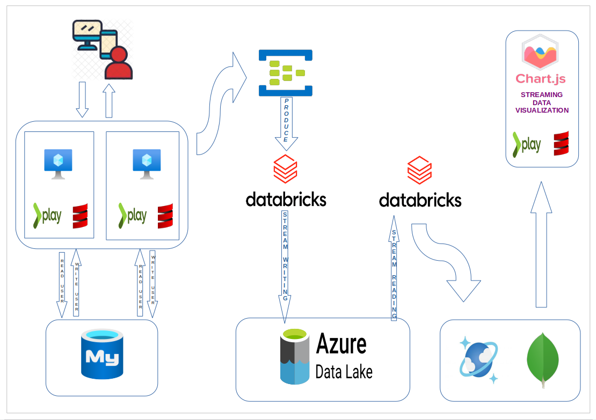

# -ClickStream-Analysis-in-a-Web-Application

# Project Overview

# ARCHITECTURE

## BACKEND

The backend component of the project, located in the `BACKEND/clickstreambackend` directory, is organized into the following key components:

- **Controllers:** Handle incoming requests and define the application's behavior.
- **DAO (Data Access Objects):** Responsible for interacting with the database.
- **Models:** Define the structure of the data used in the application.
- **Services:** Implement business logic and data processing.
- **Views:** Define the presentation layer of the application.

### Project Structure
- **Configuration:**
  - `application.conf`: Application-specific configurations.
  - `logback.xml`: Logging configuration.
  - `routes`: Defines the application's URL routes.

- **Public Resources:**
  - Static files such as JavaScript (`getads.js`, `main.js`, `producedata.js`), stylesheets (`main.css`), and images.

- **Logs:**
  - `application.log`: Log files capturing application events.

- **Testing:**
  - Unit tests for controllers located in the `test/controllers` directory.

## STREAMING-ETL

The streaming ETL (Extract, Transform, Load) component, located in the `STREAMING-ETL` directory, consists of both a Proof of Concept (POC) and production-grade code for data processing.

### POC
- Scala (`backp.scala`, `DataLakeToCosmosDB.scala`, `EventHubToDataLakeETL.scala`) and Python (`main.py`) scripts for data processing.
- Shell script (`ex.sh`) for execution.

### PRODUCTION
- Two separate projects:
  - **DataLakeToCosmos:**
    - Scala project for processing and transferring data from Data Lake to CosmosDB.
  - **EventHubToDataLake:**
    - Scala project for processing and storing data from Event Hub to Data Lake.

## TESTING

### GenerateSampleData
- Located in the `TESTING/GenerateSampleData` directory.
- Python (`consumer.py`, `generate_to_event_hubs.py`) and Scala (`main.scala`) scripts for generating and consuming sample data.

## VISUALIZATION

### Live User Dashboard
- Located in the `VISUALIZATION/live_user_dashboard` directory.
- HTML (`index.html`), CSS (`loader.css`, `styles.css`), and JavaScript (`sample_data.js`, `script.js`) files for creating a live user dashboard.

